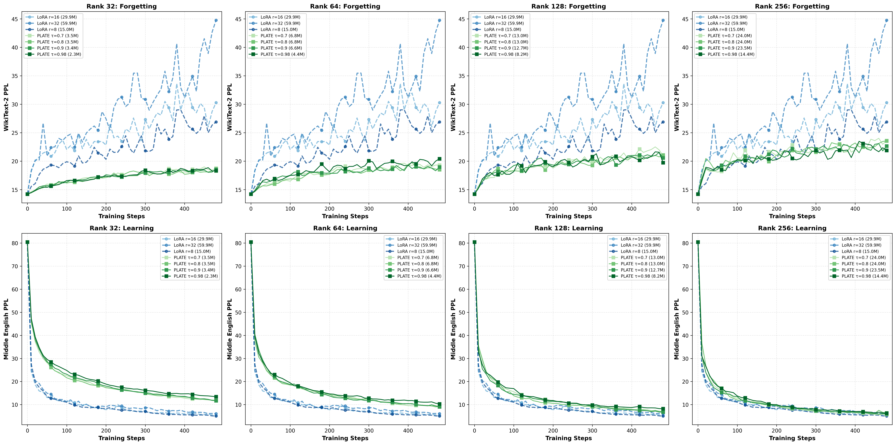
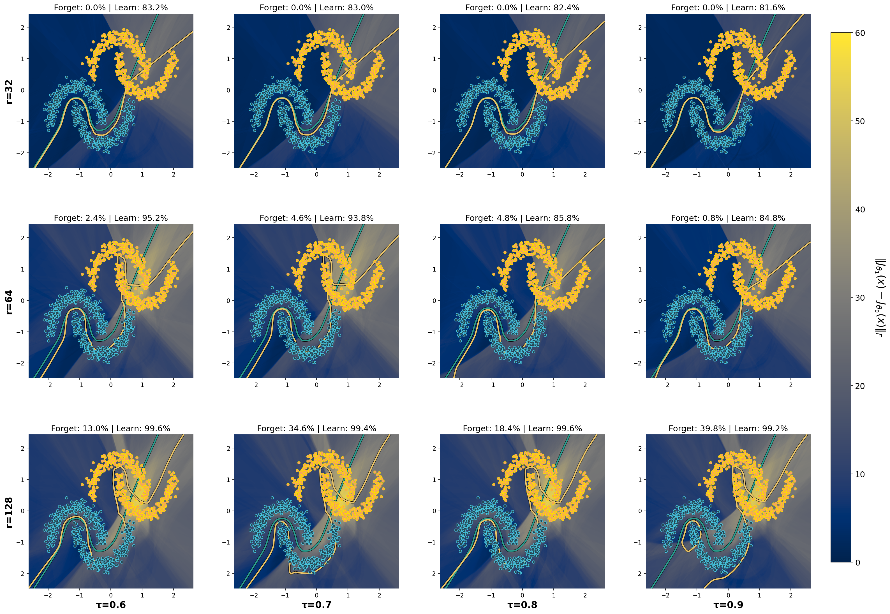

# PLATE: Plasticity-Tunable Efficient Adapters for Geometry-Aware Continual Learning
[](https://arxiv.org/abs/2602.03846)

**Paper:** https://arxiv.org/abs/2602.03846

**PLATE** (Plasticity-Tunable Efficient Adapters) is a parameter-efficient fine-tuning method that reduces catastrophic forgetting in continual learning by combining neuron selection with orthogonal input basis computation. This method does not require any pre-training (old task) data nor features.

## Installation

```bash
cd PLATE
pip install .
```

## Requirements

See `requirements.txt` for full dependencies. Minimum requirements:
- Python >= 3.8
- PyTorch >= 2.0.0
- peft >= 0.15.0
- transformers >= 4.40.0

## Quick Start

```python
from transformers import AutoModelForCausalLM
from plate import PLATEConfig, get_plate_model

# Load model
model = AutoModelForCausalLM.from_pretrained("Qwen/Qwen2.5-3B")

# Configure PLATE
config = PLATEConfig(
    r=64,             # Number of trainable neurons
    col_tau=0.9,      # Input orthogonality threshold
    plate_alpha=1.0,  # Scaling factor
    max_rank =512,    # Maximum input basis dimension
    plate_dropout=0.0,
    target_modules=["q_proj", "k_proj", "v_proj", "o_proj", "gate_proj", "up_proj", "down_proj"]
)

# Apply PLATE adapter
model = get_plate_model(model, config)

model.print_trainable_parameters()
```

## PLATE adapters 

PLATE adapts a frozen pretrained linear layer `W` using a structured PEFT-style update:

$$
W' = W + \rho \Delta W,\qquad \Delta W = B A Q^\top
$$

Only **`A`** is trained; **`B`** and **`Q`** are computed once from the frozen pretrained weights and then kept fixed.

### What are B, A, Q?

- **A (trainable):** `A ∈ R^{r×k}`  
  The only learned parameters per layer (initialized to zeros). Trainable parameter count per layer is `r * k`.

- **B (frozen output selector):** `B ∈ R^{d_out×r}`  
  Selects which **output neurons** are allowed to change. PLATE chooses the `r` most *redundant* output rows of `W`, then uses the corresponding identity columns as a selector.

- **Q (frozen input basis):** `Q ∈ R^{d_in×k}`  
  Orthonormal basis for a **low-energy input subspace** computed from the **frozen rows** of `W` (rows not selected by `B`). It constrains updates to directions that weakly excite old task data/features, reducing drift on old behavior.

---

## Hyperparameters

### Key hyperparameter

- **`r`**: number of **trainable output neurons per layer**
  - Higher `r` ⇒ more capacity for the new task, but typically more forgetting risk.

### Other hyperparameters (dimension / constraint controls)

- **`col_tau`**: input energy threshold controlling the size of the low-energy subspace (i.e., `k`)
  - Higher `col_tau` ⇒ smaller `k` (stricter constraint).
- **`max_rank`**: cap on `k` (maximum input basis dimension).
- **`rho`**: scaling factor in `W' = W + ρ * (B A Q^T)`.

These hyperparameters mainly control the input/output dimensions of the trainable adapter parameters (through `r` and `k`).

## Example

See `examples/run_example.py` for a complete training example.

## Results

### PLATE learning vs forgetting 

**Qwen 2.5-3B - PLATE sweep across (r,τ):** Columns fix the PLATE output rank r ∈ {32,64,128,256} and sweep τ ∈ {0.70,0.80,0.90,0.98} (green, solid) against LoRA baselines with varying ranks (blue, dashed). Top row reports WikiText-2 perplexity (forgetting) and bottom row reports Middle English perplexity (task learning), both over training steps.



### Local-geometry view of forgetting

**Local-geometry view of forgetting - PLATE sweep across (r,τ):** We sweep PLATE's two knobs on a two-moons continual-learning toy. Blue points denote the old-task dataset $P_0$ and yellow points the new-task dataset $P_1$; decision boundaries are shown when trained on $P_0$ (blue curve) and after training on $P_1$ (yellow curve). The background heatmap visualizes how the training on $P_1$ change the model's local input-output linearization, $\Delta(x)\coloneqq\|J_x(\theta_1,x)-J_x(\theta_0,x)\|_F$. *Retention is compromised when the heatmap turns yellow around the blue points* (large drift on supp(P_0)), while *effective learning requires yellow regions around the yellow points* (large drift concentrated near supp(P_1)). *This motivates our goal: parameter-efficient continual updates that localize drift away from the (often unavailable) old distribution while remaining expressive on the new task.* Increasing r expands the plasticity budget and improves task 2 performance but can increase task 1 drift/forgetting, while increasing τ tends to concentrate updates onto more redundant degrees of freedom and reduces drift/forgetting. Overall, PLATE provides an explicit mechanism to target a desired point on the retention-adaptation trade-off.




## Citation

If you use PLATE in your work, please cite:

```bibtex
@misc{cosentino2026plateplasticitytunableefficientadapters,
      title={PLATE: Plasticity-Tunable Efficient Adapters for Geometry-Aware Continual Learning}, 
      author={Romain Cosentino},
      year={2026},
      eprint={2602.03846},
      archivePrefix={arXiv},
      primaryClass={cs.LG},
      url={https://arxiv.org/abs/2602.03846}, 
}
